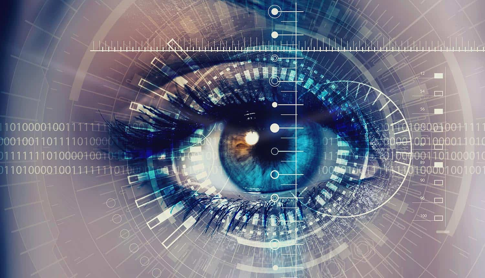

# COD 891 Minor Project: Enhancing Biometric Security using Homomorphic Encryption 

This is minor project for M.Tech. program core course supervised by Dr. Vireshwar Kumar (Sem 2, 2024, IIT Delhi).  

Submitted by: Vikas Kumar Saini (2023MCS2492)  
 
### 1. Image Acquisition: 
- Used online available Iris Database - Phoenix - UPOL
- Image information: 24 bit - RGB, 576 x 768 pixels, file format: PNG
### 2. Segmentation:
- Blurring: Used Gaussian and median blur
- Channel Splitting: used red channel to get pupil boundary
- Thresholding: used to find the pupil and iris boundaries
### 3. Normalization
- Used Daugman's Rubber Sheet Model to obtain normalized iris image of 64 x 512 pixel size
### 4. Feature Extraction
- Haar Wavelet Decomposition and 2D-Gabor Wavelets are used to reduce the image size and obtain the real and imaginary parts as image features. 
### 5. Template Creation
- Performed Phase Quadrant Demodulation to obtain the iris template of 4096 bits.
### 6. Image Registration
- CKKS HE scheme from python TenSeal library is used to homomorphically encrypt the iris template. This encrypted template is used for image registration.
### 7. Authentication
- Image to be authenticated is converted to the encrypted template, XORing is performed homomorphically to obtain encrypted Hamming distance and then it is decrypted to get the result of authentication (Used TenSeal Library for homomorphic operations and decryption).
### 8. FAR, FRR and CERR graph:

